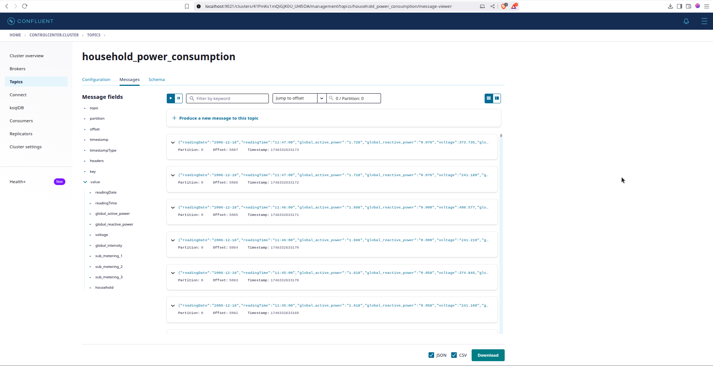
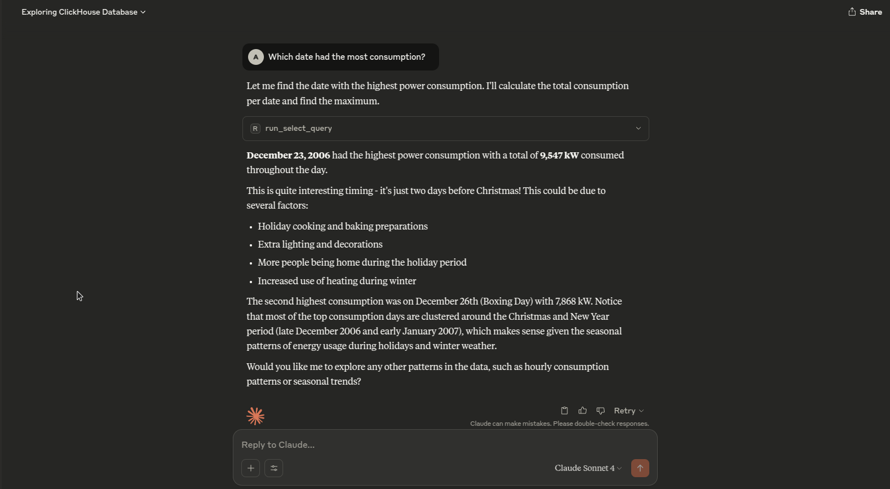

# Clickhouse with Kafka

Source code for a demo on ingesting household voltage readings into Kafka and querying analytics in Clickhouse

## Setup

1. Bring up the environment

```bash
docker-compose up -d
```

Optionally, check if data is produced using the Control Center, which runs on http://localhost:9021



2. Create the table in clickhouse

```bash
docker-compose exec clickhouse clickhouse client --query "CREATE TABLE household_power_consumption (
    readingDate String,
    readingTime String,
    global_active_power Float32,
    global_reactive_power Float32,
    voltage Float32,
    global_intensity Float32,
    sub_metering_1 Float32,
    sub_metering_2 Float32,
    sub_metering_3 Float32
) ENGINE = MergeTree()
ORDER BY (readingDate, readingTime);"
```

3. Create the connector

```bash
./create_connector.sh
```

4. Query from clickhouse

```bash
docker-compose exec clickhouse clickhouse client
```

5. Query using an MCP client (Ex. Claude Desktop)

Configure the Claude Desktop using the following configuration -

```json
{
  "mcpServers": {
    "mcp-clickhouse": {
      "command": "uv",
      "args": [
        "run",
        "--with",
        "mcp-clickhouse",
        "--python",
        "3.13",
        "mcp-clickhouse"
      ],
      "env": {
        "CLICKHOUSE_HOST": "localhost",
        "CLICKHOUSE_PORT": "8123",
        "CLICKHOUSE_USER": "plf_user",
        "CLICKHOUSE_PASSWORD": "v3ry_s3cur3",
        "CLICKHOUSE_SECURE": "false",
        "CLICKHOUSE_VERIFY": "false",
        "CLICKHOUSE_CONNECT_TIMEOUT": "30",
        "CLICKHOUSE_SEND_RECEIVE_TIMEOUT": "30"
      }
    }
  }
}
```

> You might have to replace the path to uv in the above configuration. Run `which uv` to find the path to uv. Install uv, if not already present, using `curl -LsSf https://astral.sh/uv/install.sh | sh`

